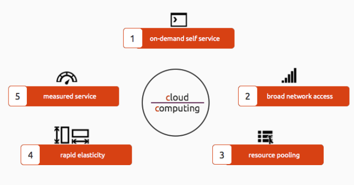
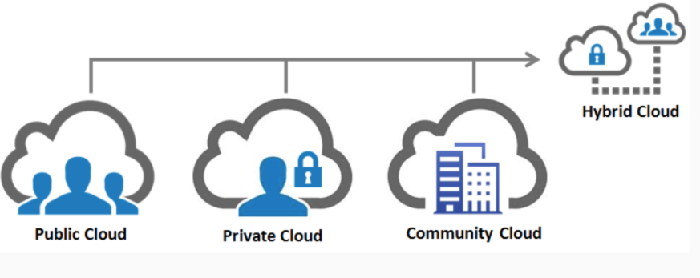
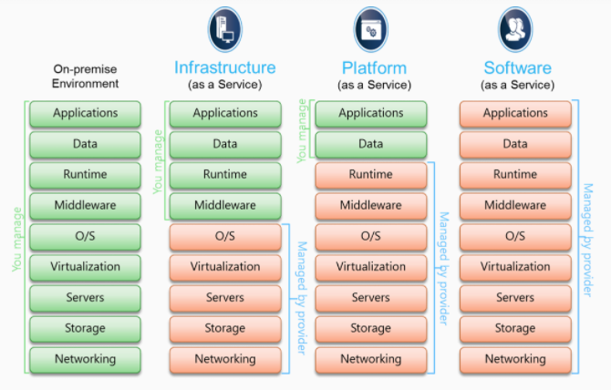

## Ghi chép về cloud computing

[1. Khái niệm](#khainiem) 
[2. 5 đặc điểm trong cloud](#dacdiem) 
[3. 4 loại mô hình dịch vụ](#dichvu) 
[4. 3 mô hình triển khai](#trienkhai) 

### 1. Khái niệm

Theo NIST (Viện tiêu chuẩn và công nghệ quốc tế): Cloud computing là mô hình cho phép truy cập qua mạng để lựa chọn và sử dụng tài nguyên có thể tính toán được (ví dụ: máy chủ, lưu trữ, ứng dụng, dịch vụ) theo nhu cầu một cách thuận tiện và nhanh chóng, đồng thời kết thúc việc sử dụng dịch vụ, giải phóng tài nguyên dễ dàng, giảm thiểu các giao tiếp với nhà cung cấp dịch vụ.

Hiểu một cách đơn giản thì Cloud Computing là việc cung cấp các dịch vụ điện toán hoàn toàn qua Internet. Cung cấp tài nguyên phù hợp với nhu cầu của người dùng thông qua internet. Các dịch vụ có thể là máy chủ, lưu trữ, ứng dụng...

Đỉnh cao của cloud là đưa tất cả hạ tầng, ứng dụng lên trên mạng internet người dùng cần dùng cái gì là cấp, không dùng nữa thì thu hồi tài nguyên cấp phát.

### 2. 5 đặc điểm trong cloud

- Khả năng thu hồi và cấp phát tài nguyên (Rapid elasticity): Tài nguyên trên dịch vụ cloud có thể được cung cấp một cách nhanh chóng, linh hoạt và có khả năng thay thay đổi theo nhu cầu sử dụng. Cần tài nguyên thì cấp không cần thì thu hồi 1 cách nhanh chóng.

- Truy nhập qua các chuẩn mạng (Broad network access): Người dùng có thể truy cập dịch vụ cloud từ bất kỳ thiết bị nào có kết nối mạng như như máy tính để bàn, laptop, thiết bị di động.

- Dịch vụ sử dụng đo đếm được (Measured service,) hay là chi trả theo mức độ sử dụng pay as you go: Tài nguyên trên dịch vụ cloud có thể được giám sát, đo lường. Tài nguyên dùng bao nhiêu trả tiền bất nhiều.

- Khả năng tự phục vụ (On-demand self-service): Cô lập tài nguyên giữa các người dùng. Người dùng có thể tự cấu hình dịch vụ theo nhu cầu một cách tự động, không cần sự can thiệp từ nhà cung cấp dịch vụ.

- Chia sẻ tài nguyên (Resource pooling): Cấp phát, chia sẻ tài nguyên theo pool, điều phối một cách linh hoạt.

### 3. 4 loại mô hình dịch vụ

Có 4 mô hình triển khai cloud computing chính đang được sử dụng phổ biến: `Private Cloud`, `Public Cloud`, `Hybrid Cloud`, `Community Cloud`.

- `Private Cloud` là mô hình cloud triển khai cho nội bộ một tổ chức sử dụng không chung với bất kỳ một tổ chức nào khác, tổ chức đó quản lý trực tiếp.

- `Public Cloud` là mô hình cloud triển khai các dịch vụ, ứng dụng đều nằm trên một hệ thống cloud, tất cả các người dùng sẽ dùng chung một khối tài nguyên, nhà cung cấp dịch vụ sẽ chịu trách nhiệm quản lý, cấp phát tài nguyên, đảm bảo an toàn dữ liệu.

- `Hybrid Cloud` là nền tảng đám mây riêng – private cloud được thiết kế riêng cho một tổ chức được cung cấp bởi 1 bên thứ 3, và các dịch vụ đám mây công cộng – public cloud (như Googke hay Amazon).

Đám mây công cộng và đám mây nội bộ hoạt động độc lập với nhau và giao tiếp thông qua kết nối được mã hóa để truyền tải dữ liệu và ứng dụng.

Hybrid Cloud cho phép một doanh nghiệp triển khai mô hình đám mây riêng "tại chỗ" để lưu trữ các dữ liệu nhạy cảm hay quan trọng, cùng lúc sử dụng dịch vụ đám mây công cộng của bên thứ ba để lưu trữ các tài nguyên ít quan trọng hơn, chẳng hạn như thử nghiệm và phát triển.

- `Community Cloud` được xây dựng nhằm mục đích chia sẻ hạ tầng, dữ liệu cho nhiều tổ chức, người dùng khác nhau. Đơn giản là cùng xây dựng 1 hạ tầng cho 1 cộng đồng trong 1 nghành vào sử dụng chia sẻ dữ liệu chung.

### 4. 3 mô hình triển khai

- Infrasructure as a service (Iaas) – Dịch vụ cơ sở hạ tầng - Cở sở hạ tầng như một dịch vụ

Iaas là mô hình dịch vụ pay-per-use (tức là trả tiền cho những gì sử dụng). Chi phí sử dụng dịch vụ này được tính dựa trên chức năng và lượng tài nguyên mà khách hàng dùng. Theo Amazon thì đây là mức độ cơ bản nhất của điện toán đám mây.

Nhà cung cấp dịch vụ Iaas sẽ bán cho khách hàng các server (máy chủ), IP, bộ nhớ, CPU, storage (không gian lưu trữ), máy tính (có thể máy thật hoặc máy ảo, tùy nhu cầu), một số tính năng đảm bảo an toàn hệ thống. Iaas không được tạo ra để phục vụ cho người dùng cuối.

Đơn giản là nhà cung cấp cho người dùng một máy chủ với cấu hình người dùng mong muốn và người dùng muốn cài đặt cài gì lên đó thì cài tùy sở thích. Điển hình là các đơn vị cung cấp cloud VPS ở Việt Nam.

- Platform as a service (Paas) – Dịch vụ nền tảng - Nền tảng như một dịch vụ

Paas là mô hình dịch vụ giúp các developer có thể phát triển. Nó cho phép triển khai các ứng dụng, website trên đám mây. Paas về cơ bản cũng khá giống với Iaas nhưng cấp độ cao hơn. Với Paas, bạn sẽ có một nền tảng (Platform) được cài đặt sẵn để phù hợp cho việc phát triển ứng dụng.

Đơn giản hiểu là dân lập trình có 1 dự án nhiều người cùng code mỗi người code một phần xong gom lại, thì Paas sẽ tạo ra một môi trường ở đó mà dân lập trình có thể đẩy code lên gom lại, kéo về, chỉnh sửa xong lại đẩy lên hoàn thành dự án.

- Software as a service (Saas) – Dịch vụ phần mềm - Phần mềm như một dịch vụ

Saas là một mô hình dịch vụ điện toán đám mây cao nhất hiện nay. Cho phép người dùng sử dụng được các ứng dụng dễ dàng trên nền tảng đám mây thông qua internet. Đơn giản hơn, Saas sẽ cung cấp phần mềm/ứng dụng chạy trên internet. Từ đó người dùng cuối (end-user) có thể sử dụng ngay. Nhà cung cấp dịch vụ Saas có thể lưu trữ trên server của họ. Hoặc cho phép người dùng tải xuống và vô hiệu hóa nó khi hết hạn.

Đơn giản là dịch vụ Gmail, Microsoft Office 365, OneDrive, Dropbox  người dùng cuối chỉ việc sử dụng dịch vụ.

