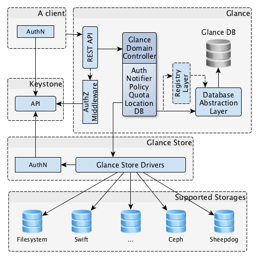

## Ghi chép mô tả về kiến trúc trong Openstack

`Openstack` theo nghĩa đơn giản là một ngăn xếp các giải pháp mở, có thể hiểu Openstack là một nơi tập hợp nhiều các giải pháp mã nguồn mở để đưa vào giải quyết bài toán ảo hóa, cloud.

### 1. Conceptual architecture

Kiến trúc khái niệm

Sơ đồ sau cho thấy mối quan hệ giữa các dịch vụ OpenStack:

- Khối trung tâm hình thoi là `VMs` là thành quả cuối cùng của hệ thống, tất cả các thành phần khác đóng góp vào để tạo lên 1 VM (provides images, provides network, provides volumes, provides boot data, provides operation and management).

**- Các khối hình chữ nhật tròn cạnh thể hiện các khái niệm cho những project chính: **

- Keystone: Cung cấp cho việc xác thực

- Ceilometer: Cung cấp monitor, mức độ sử dụng của hệ thống.

- Horizon: Cung cấp giao diện làm việc trong openstack

- Glance: Tìm và nạp images, boot database instances

- Neutron: Cung cấp network cho VM

- Ironic: cung cấp bare metal machines, được coi như một bare metal hypervisor API và một tập hợp các plugin tương tác với bare metal hypervisors.

Một hypervisor ở dạng native (hay còn gọi bare-metal) chạy trực tiếp trên phần cứng. Nó nằm giữa phần cứng và một hoặc nhiều hệ điều hành khách (guest operating system). ... Các hypervisor dạng native này có thể kể đến như VMware ESXi, Microsoft Hyper-V

- Nova: Cung cấp các thuộc tính của máy ảo, các process trong máy ảo.

- Cinder: Cung cấp thành phần volumes cho máy ảo.

- Swift: Backup cho volumes, backup database openstack, backup images. Tương thích với S3 API.

- Trove: được thiết kế để support database với một Nova instance. Cho phép người dùng nhanh chóng và dễ dàng sử dụng các tính năng của cơ sở dữ liệu quan hệ hoặc phi quan hệ mà không phải xử lý các tác vụ quản trị phức tạp. Ngời dùng cloud và quản trị database có thể cung cấp và quản lý multiple database instances nếu cần. Ban đầu các service sẽ được tập trung vào cung cấp các tài nguyên riêng biệt resource isolation hiệu năng cao trong khi tự động hóa các task phức tạp bao gồm deployment, configuration, patching, backups, restores, monitoring.

Nó tạo ra lớp abstract giữa người dùng và database, thực hiện dự phòng, mở rộng và quản lý database trên hạ tầng OpenStack.

- Heat:  Cung cấp template cho những dúng dụng phổ biến, template sẽ mô tả các thành phần compute, storage, networking để đáp ứng nhu cầu của ứng dụng. Kết hợp với Ceilometer để có thể tự co giãn tài nguyên, tương thích với AWS CloudFormation APIs.

- Sahara: Data Processing, là dịch vụ cung cấp các cụm Hadoop (tập hợp các phần mềm có mã nguồn mở) một cách dễ dàng và nhanh chóng.

### 2. Basic architecture

OpenStack Glance  có một kiến trúc client-server cũng cấp một REST API để người dùng có thể gửi request lên server để thực hiện.

Khối Glance Domain Controller quản lý sự hoạt động của máy chủ chia thành các lớp. Nhiệm vụ được thực hiện theo từng lớp. Tất cả các  file (Image data) thực hiện sử dụng glance_store library, thư viện này chịu trách nhiệm tương tác với external storage back ends and (or) local filesystem(s). Glance_store library cung cấp một interface    

### 3. Logical architecture

Để thiết kế và triển khai, cấu hình cài đặt trong Openstack thì ngươi quản trị phải hiểu được kiến trúc logic.

